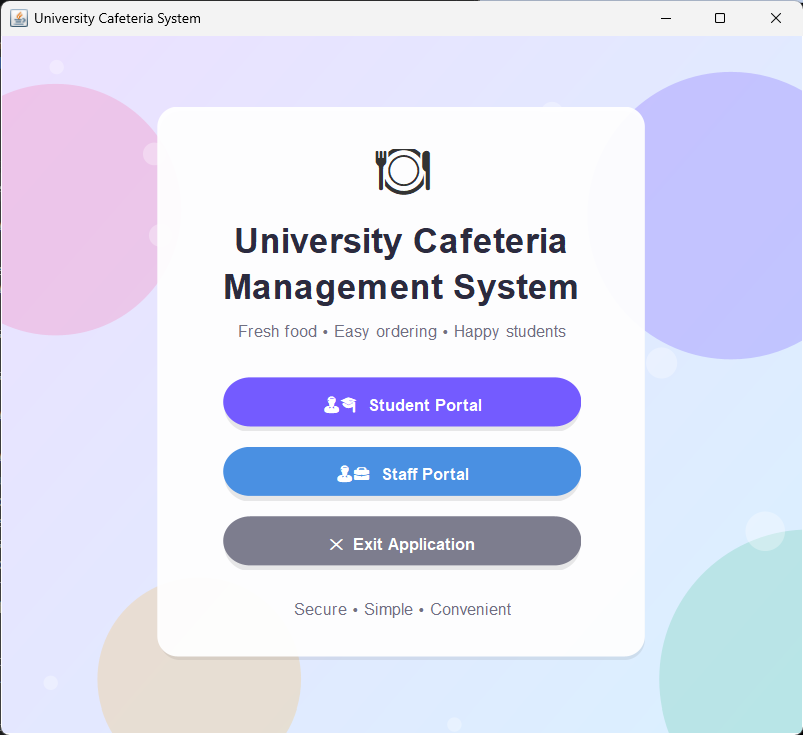
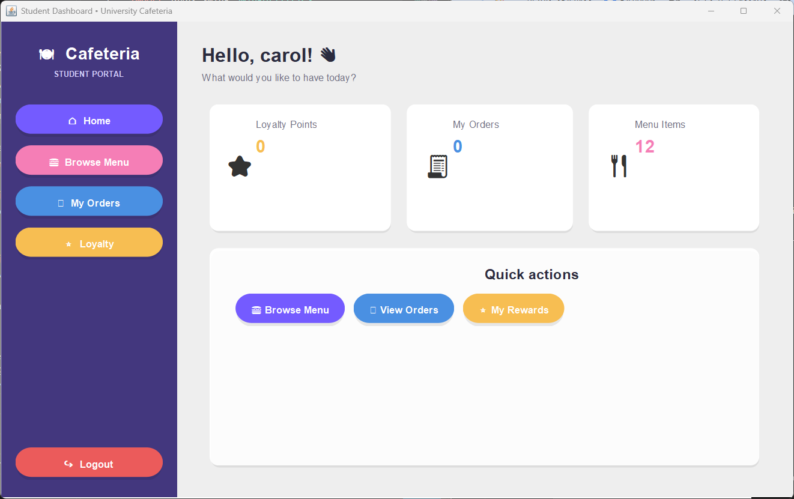
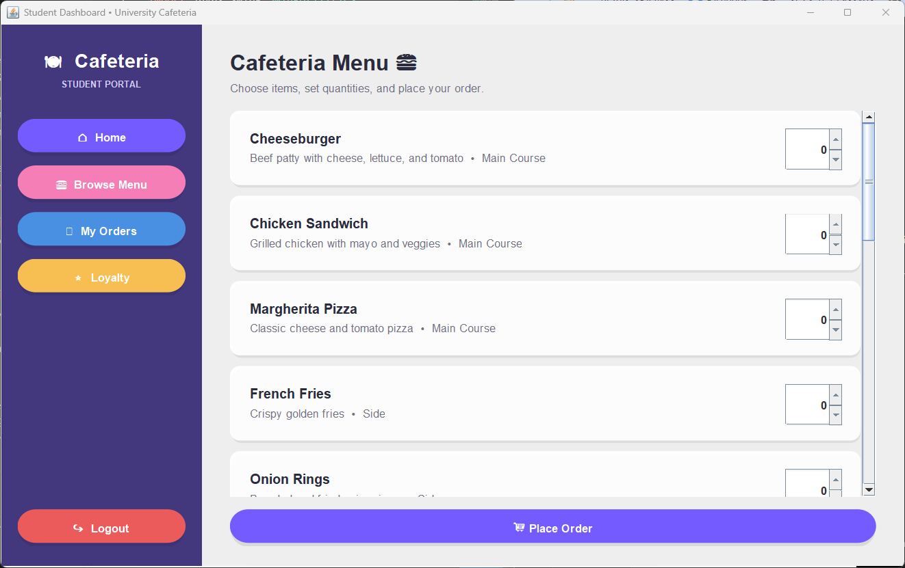
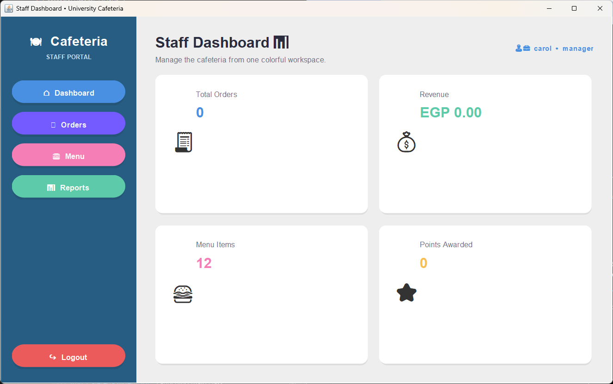

# 🍽️ Cafeteria Management System

A Java-based cafeteria management system designed to manage students, staff, menu items, orders, authentication, loyalty points, and reports through a user-friendly graphical interface.

---

## 📌 About the Project

The Cafeteria Management System is a desktop application developed using Java Swing and MongoDB.

The system provides separate functionality for students and staff. Students can register, log in, browse cafeteria items, place orders, and manage their loyalty points. Staff members can manage cafeteria operations, students, menu items, orders, and reports.

This project demonstrates Object-Oriented Programming, GUI development, database integration, authentication, CRUD operations, and software project organization.

---

## ✨ Features

### 🎓 Student Features

- Student registration
- Student login
- Student authentication
- Browse cafeteria menu
- Place orders
- View orders
- Loyalty points management
- Student account management

### 👨‍💼 Staff Features

- Staff login
- Staff dashboard
- Manage students
- Manage menu items
- Manage orders
- View cafeteria information
- Generate reports

### 🔐 Authentication

- Student authentication
- Staff authentication
- Role-based access
- Separate student and staff dashboards

### 🗄️ Database Integration

- MongoDB database integration
- Student data persistence
- MongoDB Java Driver
- Local MongoDB database

---

## 🛠️ Technologies Used

- Java 21
- Java Swing
- Maven
- MongoDB
- MongoDB Java Driver
- Git
- GitHub
- Object-Oriented Programming (OOP)

---

## 📂 Project Structure

```text
cafeteria-management-system/
│
├── Authenticatable.java
├── AuthenticationService.java
├── CafeteriaApp.java
├── CafeteriaSystem.java
├── CafeteriaSystemGUI.java
├── LoginFrame.java
├── LoyaltyManager.java
├── MenuItem.java
├── MenuManager.java
├── MongoDBConnection.java
├── OrderItem.java
├── OrderManager.java
├── OrderService.java
├── ReportService.java
├── Staff.java
├── StaffDashboard.java
├── StaffLoginDialog.java
├── StaffManager.java
├── Student.java
├── StudentDashboard.java
├── StudentLoginDialog.java
├── StudentOrder.java
├── StudentManager.java
├── UITheme.java
│
├── screenshots/
│   ├── login.png
│   ├── student-dashboard.png
│   ├── cafeteria-menu.png
│   └── staff-dashboard.png
│
├── pom.xml
├── RUN_GUI.txt
└── README.md
```

---

## 🗄️ MongoDB Database

The application uses MongoDB to store student information.

### Database

```text
cafeteria_db
```

### Collection

```text
students
```

### Local Connection

```text
mongodb://localhost:27017
```

MongoDB must be running locally for the database features to work correctly.

---

## 🖥️ Graphical User Interface

The application uses Java Swing to provide a graphical interface for students and staff.

The main GUI entry point is:

```text
CafeteriaSystemGUI.java
```

The application includes:

- Login interface
- Student dashboard
- Cafeteria menu
- Order management
- Staff dashboard
- Colorful and user-friendly interface

---

## 📸 Application Screenshots

### 🔐 Login



### 🎓 Student Dashboard



### 🍔 Cafeteria Menu



### 👨‍💼 Staff Dashboard



---

## ▶️ How to Run

### 1️⃣ Requirements

Make sure you have installed:

- Java 21
- Maven
- MongoDB
- Git

### 2️⃣ Start MongoDB

Make sure your local MongoDB server is running.

The application connects to:

```text
mongodb://localhost:27017
```

### 3️⃣ Clone the Repository

```bash
git clone https://github.com/CAROLJOY26/cafeteria-management-system.git
```

Then open the project folder:

```bash
cd cafeteria-management-system
```

### 4️⃣ Compile the Project

Run:

```bash
mvn clean compile
```

### 5️⃣ Run the GUI

The main GUI class is:

```text
CafeteriaSystemGUI
```

The application starts with the login screen.

---

## 🔄 Application Workflow

```text
                ┌─────────────────────┐
                │   Cafeteria System  │
                └──────────┬──────────┘
                           │
                    ┌──────▼──────┐
                    │    Login    │
                    └──────┬──────┘
                           │
              ┌────────────┴────────────┐
              │                         │
       ┌──────▼──────┐           ┌──────▼──────┐
       │   Student   │           │    Staff    │
       │    Login    │           │    Login    │
       └──────┬──────┘           └──────┬──────┘
              │                         │
       ┌──────▼─────────┐        ┌──────▼─────────┐
       │    Student     │        │     Staff      │
       │   Dashboard    │        │    Dashboard   │
       └──────┬─────────┘        └──────┬─────────┘
              │                         │
       ┌──────▼─────────┐        ┌──────▼─────────┐
       │ Menu & Orders  │        │ Management &   │
       │ Loyalty Points │        │    Reports     │
       └────────────────┘        └────────────────┘
```

---

## 🎯 Learning Objectives

This project demonstrates practical experience with:

- Object-Oriented Programming
- Java application development
- Java Swing GUI development
- MongoDB database integration
- Maven dependency management
- Authentication systems
- CRUD operations
- Software architecture
- Git and GitHub
- Project organization and documentation

---

## 🚀 Future Improvements

Possible future improvements include:

- Password hashing and improved security
- Persistent loyalty point storage
- Advanced order tracking
- Online payment integration
- Improved reporting and analytics
- Admin account management
- Better database validation
- Cloud database deployment
- More responsive UI design

---

## 👩‍💻 Author

**Carol Joseph Gorgi**

GitHub: [CAROLJOY26](https://github.com/CAROLJOY26)
